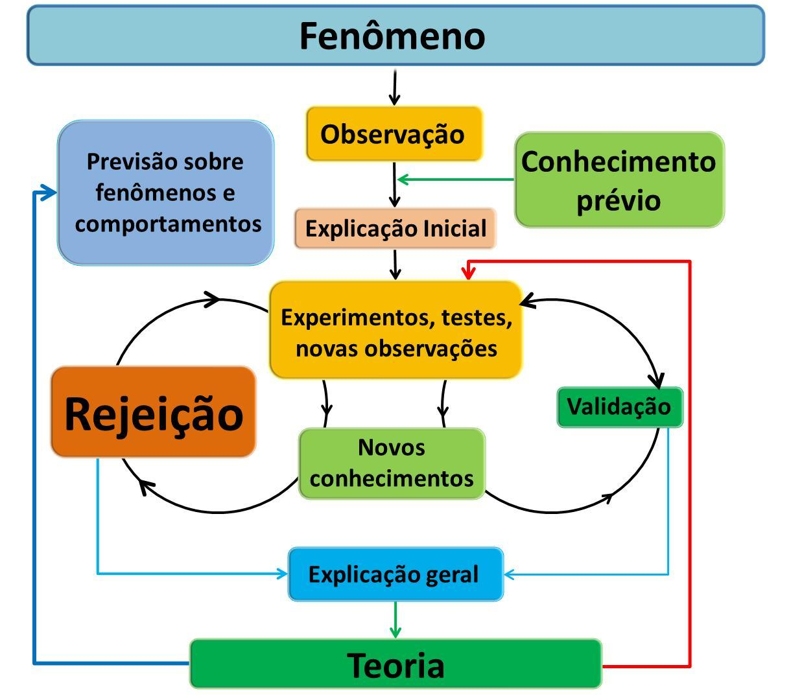
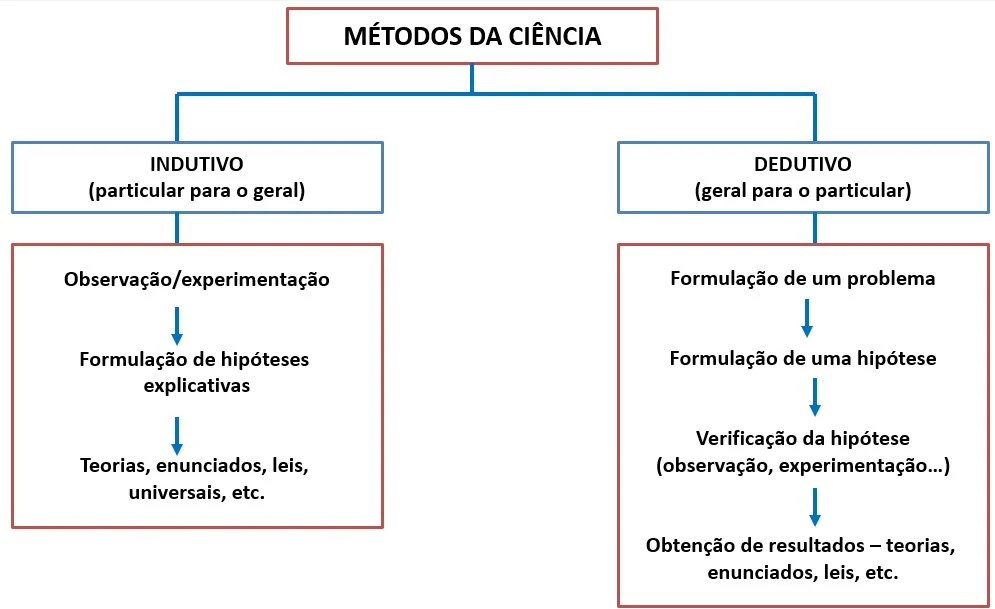
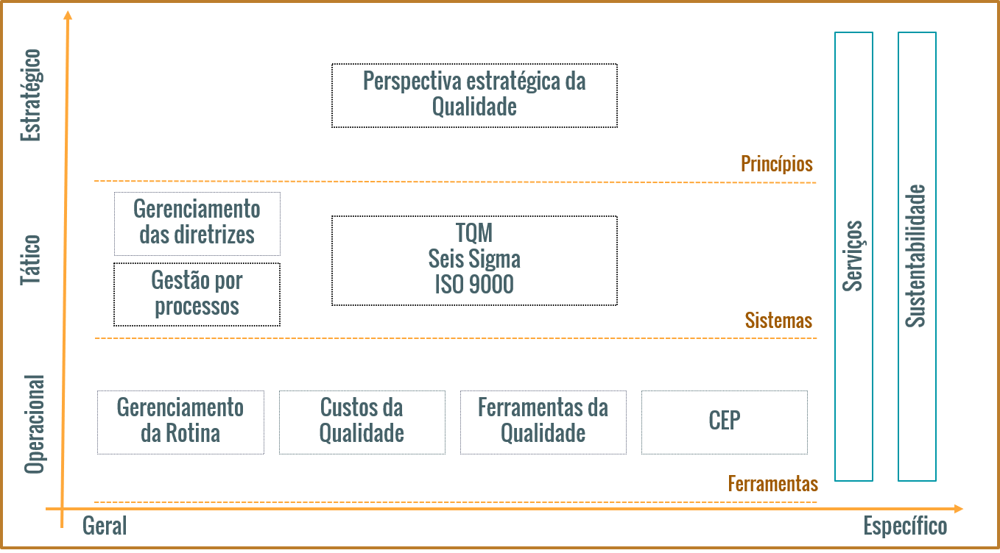

```{r setup, include=FALSE}
options(htmltools.dir.version = FALSE)
```

```{r xaringan-themer, include=FALSE, warning=FALSE}
library(xaringanthemer)
style_duo_accent(
  primary_color = "#1381B0",
  secondary_color = "#FF961C",
  inverse_header_color = "#FFFFFF"
)
```

class: center, middle

# Semana 4 - O QUE É QUALIDADE?

---
## Um pouco de história e filosofia..... 

+ Qualidade (do Latim qualitas) é um **atributo** ou uma **propriedade**. Os atributos são imputáveis por um sujeito enquanto as propriedades são inerentes. Na filosofia contemporânea, a ideia de qualidade e especialmente como distinguir certos tipos de qualidade de outros permanece controversa.

+ Qualidade é uma noção que foi desenvolvida por _Platão_ no contexto de sua _Teoria das Formas_, em que elaborou níveis de atributos e suas relações participantes nas Ideias. _Aristóteles_ analisou qualidades em seu livro _Categorias_, trabalho lógico em que incluiu-a como uma das dez categorias.


---

## Um pouco de história e filosofia..... 

+ _John Locke_ apresentou uma distinção entre qualidades **primárias** e **secundárias** em _Um Ensaio acerca do Entendimento Humano_. Para Locke, **uma qualidade é uma ideia de uma sensação ou percepção**. Locke afirma ainda que as qualidades podem ser divididas em dois tipos: qualidades primárias e secundárias. As qualidades primárias são intrínsecas a um objeto - uma coisa ou uma pessoa - enquanto as qualidades secundárias dependem da interpretação do modo subjetivo e do contexto da aparência.

De forma sintética e contemporânea, o conceito de qualidade pode ser definido assim: 

+ Qualidade é o **grau de utilidade esperado ou adquirido de qualquer coisa**, verificável através da _forma_ e de seus _elementos constitutivos_ e pelo _resultado_ do seu uso. A palavra "qualidade" tem um conceito subjetivo que está relacionada com as **percepções, necessidades e resultados em cada indivíduo**. Diversos fatores, como a cultura, modelos mentais, tipo e produto ou serviço prestado, necessidades e expectativas influenciam diretamente a percepção da qualidade.
---
class: center
# Método x Filosofia
```{r echo=FALSE, out.width="70%"}

```
---
class: center
# Método x Filosofia
```{r echo=FALSE, out.width="70%"}

```

---
## Componentes da Gestão da Qualidade Total

Níveis de planejamento

---
class: middle
###  UTILIDADE + VALOR + EXPECTATIVAS

--

### PERFEIÇÃO E OTIMIZAÇÃO

--
###  CONFLITO EM RELAÇÃO AOS OBJETIVOS DOS STAKEHOLDERS

--
###  CONCORRÊNCIA

--
###  RESPONSIVIDADE X BUROCRACIA

--
### PADRONIZAÇÃO X FLEXIBILIZAÇÃO

--
### INCONSISTÊNCIA ENTRE VISÃO/MISSÃO/VALORES E OPERAÇÃO


---
class: inverse, center, middle

# HUMANIZAÇÃO DA TOMADA DE DECISÕES E RESILIÊNCIA


---
class: center, middle

# Semana 5 - Normalização e Normas ISO
Respondam as perguntas no EdPuzzle. Vou avaliar por lá! 

---
class: inverse, center, middle

# Dúvidas

